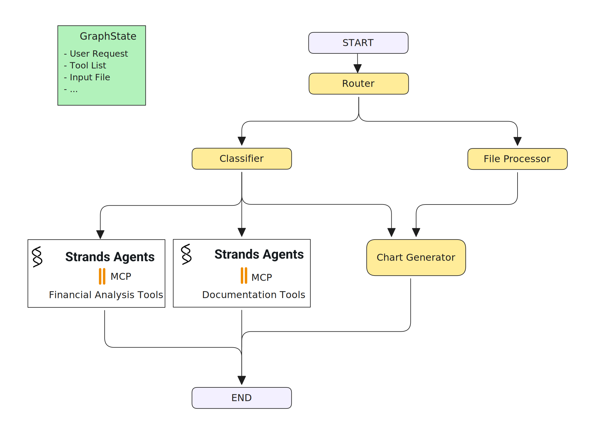
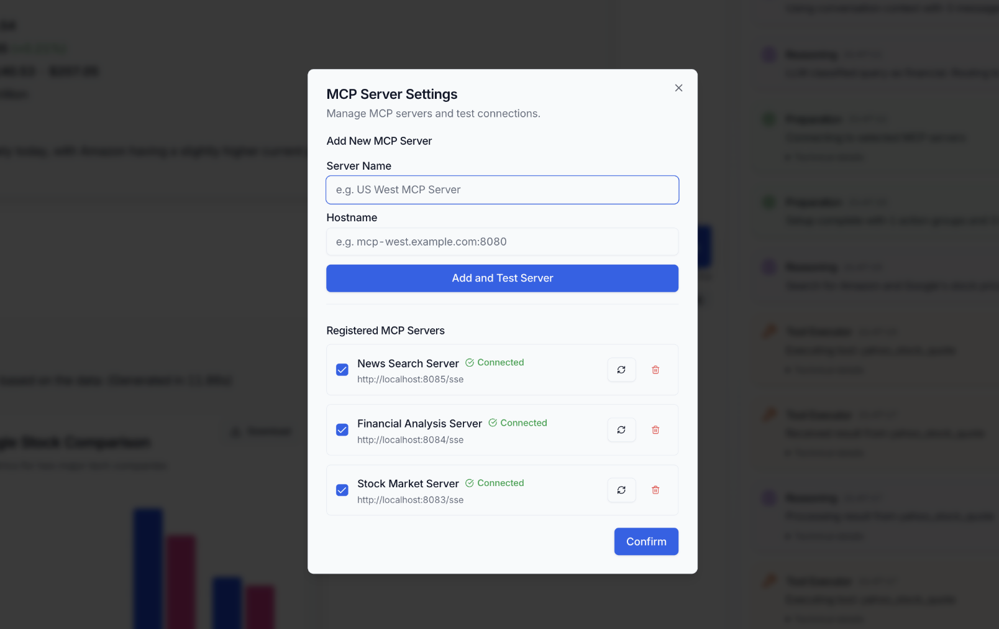
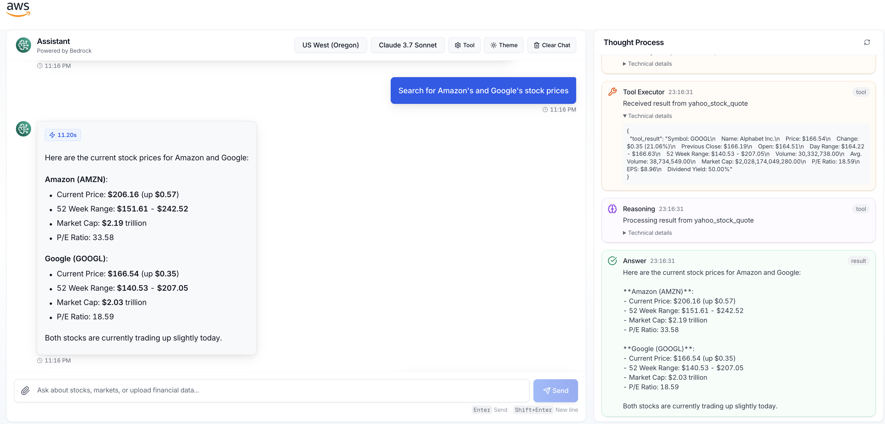
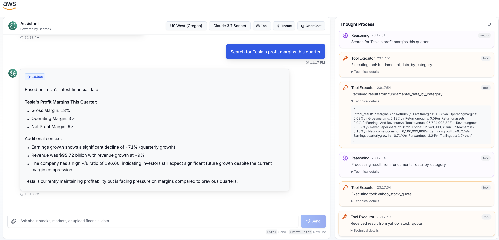
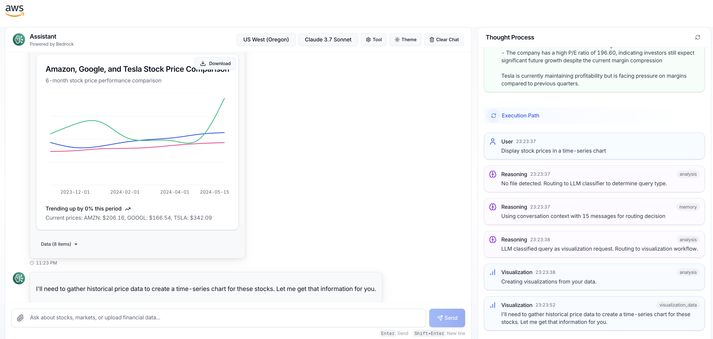

# 金融分析 Agent

> 基于 LangGraph、Strands Agent 和 AWS Bedrock 构建的智能金融助手，集成 MCP 协议

<div align="left"></div>

## 概述

金融分析 Agent 是一个 AI 驱动的助手，专为处理各种金融需求、文档生成和查询而设计。基于混合架构构建，结合了 LangGraph 的结构化工作流、Strands Agent 框架和 AWS Bedrock 的强大语言模型，该 agent 能够分析金融数据、生成专业文档、提供洞察并协助金融决策。

## 核心功能

### 金融领域专业能力
- 处理和分析金融需求、股票数据、市场趋势和其他金融信息
- 生成金融报告和摘要
- 提供市场洞察和投资分析
- 实时股票报价和历史数据分析

### 文档生成
- **Word 文档创建**：生成具有结构化格式的专业 Word 文档
- **金融报告**：创建全面的金融分析报告
- **图表集成**：在文档中嵌入 matplotlib 生成的图表和可视化
- **下载管理**：安全的文件下载系统，支持自动清理

### 先进的 AI 架构
- **LangGraph + Strands 集成**：结合 LangGraph 的工作流管理和 Strands Agent 的工具编排
- **AWS Bedrock 集成**：由 Claude 3.7 Sonnet 和其他先进语言模型驱动
- **流式响应**：实时思维过程可视化，带缓冲推理显示

### 模块化 MCP 集成
- **可扩展功能**：标准化的 MCP (Model Context Protocol) 工具，支持各种领域
- **Financial Analysis Server**：高级金融计算和分析
- **Stock Market Server**：实时市场数据和历史分析
- **Web News Server**：金融新闻聚合和情感分析
- **Word Generator Server**：专业文档创建，支持图表
- **PDF Generator Server**：PDF 文档生成功能

### 交互式用户界面
- 简洁直观的聊天界面，支持自然对话
- 实时思维过程面板，显示 agent 推理过程
- 生成文档的下载按钮
- MCP 服务器管理界面
- 主题支持（明亮/暗黑模式）

## 架构

系统架构结合了几项关键技术：

### 为什么选择 LangGraph？

LangGraph 为该 agent 提供了几个优势：

- **模块化开发**：将复杂的金融推理分解为可管理的组件
- **直观的推理流程**：在架构层面编程 agent 的思维过程
- **结构化控制流**：指导 agent 如何处理不同的金融问题
- **递归处理**：允许 agent 递归处理金融信息，直到达到满意的答案

### Agent 工作流程

该 agent 采用 ReAct (Reasoning + Action) 方法来解决金融查询：

1. Agent 接收用户的金融问题
2. 使用 LangGraph，构建关于如何处理问题的推理结构
3. 确定回答查询可能需要的工具
4. 使用标准化协议动态访问必要的 MCP 工具
5. 递归处理信息，在需要时回到推理阶段
6. 向用户呈现全面的答案

### MCP 工具集成

该 agent 可以通过各种 MCP 工具扩展不同金融领域的功能：

- **Financial Analysis Tools**：比率分析、趋势评估、财务报表分析
- **Stock Market Tools**：实时报价、历史数据、技术指标
- **News Analysis**：金融新闻情感分析、市场影响预测
- **Portfolio Management**：资产配置、风险评估、多元化分析

添加新的 MCP 服务器：

1. 点击 UI 中的设置图标
2. 在 MCP Server Settings 对话框中输入服务器名称和主机名
3. 点击 "Add and Test Server" 验证连接

<div align="left"></div>

## 安装

### 前置要求

- Node.js (版本 18+)
- Python 3.10+
- 具有 Bedrock 访问权限的 AWS 账户

### 设置

1. 克隆仓库：

```bash
git clone https://github.com/3P-Agentic-Frameworks.git
cd 3P-Agentic-Frameworks/langgraph/financial-agent
```

2. 设置 Python 虚拟环境：

```bash
# 创建虚拟环境
python -m venv .venv

# 激活虚拟环境
source .venv/bin/activate
```

3. 安装前端依赖：

```bash
npm install
```

4. 安装后端依赖：

```bash
cd py-backend
pip install -r requirements.txt
```

## 使用方法

1. 启动开发服务器：

```bash
npm run dev
```

此命令将同时启动 Next.js 前端和 Python 后端服务器。

2. 在浏览器中打开 `http://localhost:3000`

3. 使用聊天界面询问金融问题

4. 通过设置面板配置 MCP 服务器以扩展功能

<div align="left"></div>

<div align="left"></div>

<div align="left"></div>

## 项目结构

```
financial-agent/
├── app/                # Next.js 应用目录
├── components/         # React 组件
├── hooks/             # 自定义 React hooks
├── lib/               # 工具函数
├── public/            # 静态资源
├── py-backend/        # Python 后端，使用 FastAPI
│   ├── app/           # 后端应用代码
│   └── requirements.txt  # Python 依赖
├── utils/             # 前端工具
└── README.md          # 项目文档
```

## 部署配置

### 环境变量

创建适当的环境变量文件：

**开发环境 (`.env.local`)**：
```bash
NEXT_PUBLIC_API_BASE_URL=http://localhost:8000
BACKEND_URL=http://localhost:8000
```

**生产环境 (`.env.production`)**：
```bash
NEXT_PUBLIC_API_BASE_URL=https://your-domain.com
BACKEND_URL=http://localhost:8000
```

### MCP 服务器

项目包含 5 个内置的 MCP 服务器：

1. **Stock Market Server** (端口 8083) - 股票市场数据
2. **Financial Analysis Server** (端口 8084) - 金融分析计算
3. **Web News Server** (端口 8085) - 金融新闻搜索
4. **Word Generator Server** (端口 8089) - Word 文档生成
5. **PDF Generator Server** - PDF 文档生成

### 生产部署

1. 构建应用：
```bash
npm run build
```

2. 启动生产服务器：
```bash
npm run start
```

3. 使用反向代理（如 Nginx）配置域名和 SSL

## 技术栈

- **前端**: Next.js 15, React 18, TypeScript, Tailwind CSS
- **后端**: Python FastAPI, LangGraph, Strands Agent
- **AI 模型**: AWS Bedrock (Claude 3.7 Sonnet)
- **协议**: MCP (Model Context Protocol)
- **数据库**: JSON 文件配置
- **部署**: Docker 支持，Nginx 反向代理

## 贡献

欢迎贡献代码！请遵循以下步骤：

1. Fork 项目
2. 创建功能分支 (`git checkout -b feature/AmazingFeature`)
3. 提交更改 (`git commit -m 'Add some AmazingFeature'`)
4. 推送到分支 (`git push origin feature/AmazingFeature`)
5. 打开 Pull Request

## 许可证

本项目采用 MIT 许可证 - 查看 [LICENSE](LICENSE) 文件了解详情。

## 支持

如果您遇到问题或有疑问，请：

1. 查看 [Issues](https://github.com/3P-Agentic-Frameworks/issues) 页面
2. 创建新的 Issue 描述您的问题
3. 提供详细的错误信息和复现步骤

---

**注意**: 专业术语如 LangGraph、Strands Agent、AWS Bedrock、MCP、FastAPI 等保持英文原文，以确保技术准确性。